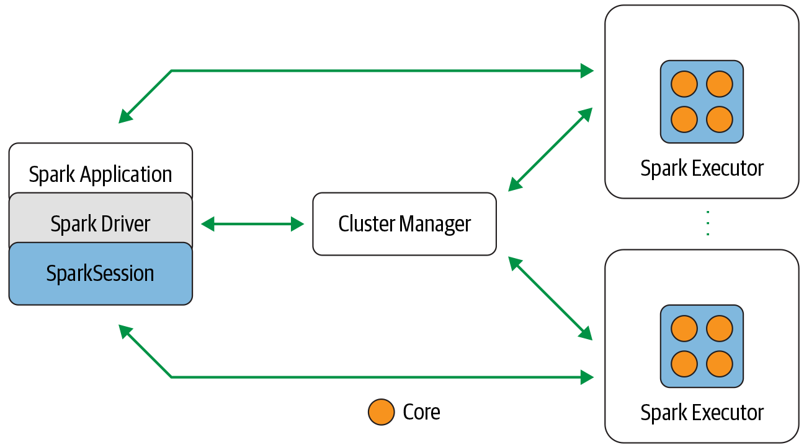

# Introduction

## What Is Apache Spark?
Apache Spark is a unified engine designed for large-scale distributed data processing,
on premises in data centers or in the cloud. 

Spark provides in-memory storage for intermediate computations, making it much
faster than Hadoop MapReduce. It incorporates libraries with composable APIs for
machine learning (MLlib), SQL for interactive queries (Spark SQL), stream process‐
ing (Structured Streaming) for interacting with real-time data, and graph processing
(GraphX). 

Spark’s design philosophy centers around four key characteristics:
* Speed
* Ease of use
* Modularity
* Extensibility

**Component and architecture**

## What This Repository contains?
This repo includes several pyspark -spark lib for pthon- notebook.These notebooks cover several spark usecases in Machine Learning and Exploratory Data Analysis. Also these usecases are for practice spark in local computer and the spark configuration might change in case of developing in clusters.

## What is next?
In near future new notebooks covering new topics in data science using pyspark will be added with detailed explanation soon.  

